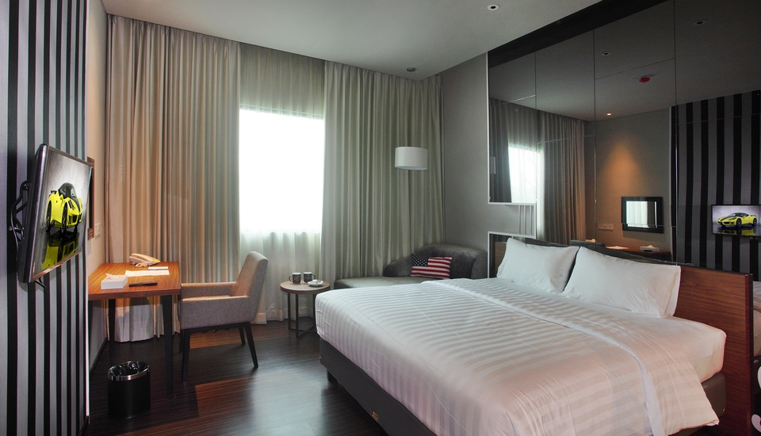

# Membuat Layout dan Desain Halaman Web dengan CSS

- index.html
```JavaScript
<html lang="en">
<head>
    <meta charset="UTF-8">
    <meta name="viewport" content="width=device-width, initial-scale=1.0">
    <title>Document</title>
    <link rel="stylesheet" href="style.css">
</head>
<body style="background-image: url(hotel4.jpg); " >
    <ul class="nav">
        <li><a href="index.html">Home</a></li>
    </ul>

    <h1 class="text-center head">WELCOME TO OUR HOTEL</h1>

    <div class="product center">
    <h2>Economy</h2>
        
        <ul class="detail">
        	<li>Kelas		: Economy</li>
        	<li>Harga		: Rp150.000,00</li><br>
        	<li>Fasilitas	: </li><br>
        	<ol>
        		<li>Sarapan</li>
        		<li>Ruangan AC</li>
        		<li>Air Hangat di Kamar Mandi</li>
        	</ol>
        </ul>
        <table class="center" border="0" style="width: 10%; clear: both;">
            <tr>
                <td><a href="pesan.html"><input type="submit" value="pesan"></input></td></a>
            </tr>
        </table>
    </div>

    <div class="product center">
    <h2>Buisness</h2>
        
        <ul class="detail">
        	<li>Kelas		: Buisness</li>
        	<li>Harga		: Rp250.000,00</li><br>
        	<li>Fasilitas	: </li><br>
        	<ol>
        		<li>Sarapan</li>
        		<li>Ruangan AC</li>
        		<li>Air Hangat di Kamar Mandi</li>
        		<li>Wifi</li>
        		<li>Tv</li>
        	</ol>
        </ul>
        <table class="center" border="0" style="width: 10%; clear: both;">
            <tr>
                <td><a href="pesan.html"><input type="submit" value="pesan"></input></a></td>
            </tr>
        </table>
    </div>

    <div class="product center">
    <h2>Buisness</h2>
        
        <ul class="detail">
        	<li>Kelas		: Luxury</li>
        	<li>Harga		: Rp150.000,00</li><br>
        	<li>Fasilitas	: </li><br>
        	<ol>
        		<li>Sarapan</li>
        		<li>Ruangan AC</li>
        		<li>Air Hangat di Kamar Mandi</li>
        		<li>Wifi</li>
        		<li>Tv</li>
        		<li>Makan Siang</li>
        		<li>Kulkas</li>
        	</ol>
        </ul>
        <table class="center" border="0" style="width: 10%; clear: both;">
            <tr>
                <td><a href="pesan.html"><input type="submit" value="pesan"></input></td></a>
            </tr>
        </table>
    </div>
    
    <br />
    <br />
    <br />
    <br />
    <div class="footer">copyright @2020 by Budi Santoso</div>
</body>
</html>
```

- style.css
```JavaScript
/* Style Default */
body {
  font-family: 'Slabo 27px', serif;
}

h1 {
  border-bottom: 1px solid rgba(0, 0, 0, .1);
  padding-bottom: 10px;
}

.separator {
  width: 100%;
  height: auto;
  overflow: hidden;
}

/* Style Untuk Soal 1, 2, dan 3. Gunakan Dengan Sesuai! */

.box-100 {
  width: 100px;
  height: 100px;
  float: left;
  margin: 20px;
  padding: 20px;
  font-size: 15pt;
  text-align: center;
}

.box-200 {
  width: 200px;
  height: 200px;
  float: left;
  margin: 20px;
  padding: 20px;
  font-size: 15pt;
  text-align: center;
}

#maroon-box {
  color: #FFFFFF;
  background: #96281B;
}

#dark-blue-box {
  color: #FFFFFF;
  background: #4B77BE;
}

#salem-box {
  color: #FFFFFF;
  background: #1E824C;
}

.red-background {
  color: #FFFFFF;
  background: #C0392B;
}

.blue-background {
  color: #FFFFFF;
  background: #446CB3;
}

.green-background {
  color: #FFFFFF;
  background: #26A65B;
}

.box-list div {
  width: 200px;
  height: 200px;
  float: left;
  margin: 20px;
  padding: 20px;
  font-size: 15pt;
  text-align: center;
  background: #353535;
  color: #FFFFFF;
}

#gold-box {
  border-radius: 20px;
  color: #353535;
  background: #F9BF3B;
/* Style Default */
body {
  font-family: 'Slabo 27px', serif;
}

h1 {
  border-bottom: 1px solid rgba(0, 0, 0, .1);
  padding-bottom: 10px;
}

.separator {
  width: 100%;
  height: auto;
  overflow: hidden;
}

/* Style Untuk Soal 1, 2, dan 3. Gunakan Dengan Sesuai! */

.box-100 {
  width: 100px;
  height: 100px;
  float: left;
  margin: 20px;
  padding: 20px;
  font-size: 15pt;
  text-align: center;
}

.box-200 {
  width: 200px;
  height: 200px;
  float: left;
  margin: 20px;
  padding: 20px;
  font-size: 15pt;
  text-align: center;
}

#maroon-box {
  color: #FFFFFF;
  background: #96281B;
}

#dark-blue-box {
  color: #FFFFFF;
  background: #4B77BE;
}

#salem-box {
  color: #FFFFFF;
  background: #1E824C;
}

.red-background {
  color: #FFFFFF;
  background: #C0392B;
}

.blue-background {
  color: #FFFFFF;
  background: #446CB3;
}

.green-background {
  color: #FFFFFF;
  background: #26A65B;
}

.box-list div {
  width: 200px;
  height: 200px;
  float: left;
  margin: 20px;
  padding: 20px;
  font-size: 15pt;
  text-align: center;
  background: #353535;
  color: #FFFFFF;
}

#gold-box {
  border-radius: 20px;
  color: #353535;
  background: #F9BF3B;
.nav {
    position: sticky;
    top: 0;
    background-color: #bdbfbf; 
    margin: 0;
    padding: 0;
}

.nav li {
    display: inline-block;
    padding: 15px;
}

body {
    margin: 0;
    padding: 0;
   
}

img {
    width: 400px;
    height: 300px;
}


.proses {
    font-style: tahoma;
}

form {
    padding: 10px;
}

h2 {
    text-align: center;
}

.center {
    display: block;
    margin: auto;
}

.text-center {
    text-align: center;
}

.product {
    border: 1px solid black;
    padding: 25px;
    width: 900px;
    margin-bottom: 15px;
    background-color: #f6f0f0;
}

.product2 {
    border: 1px solid black;
    padding: 25px;
    width: 500px;
    margin-bottom: 15px;
    background-color: #f6f0f0;
}

.detail {
    padding: 15px;
    margin: 10px;
    float: left;
}

.footer {
    background-color: gray;
    text-align: center;
    color: white;
    padding: 15px;
    position: fixed;
    bottom:0px;
    width: 100%;
}

.form-order tr td {
    padding: 15px;
}
```